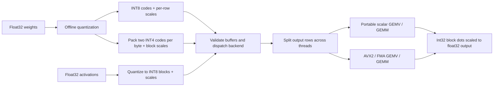

# int8k

C++20 library and CLI for INT8/INT4 quantization and CPU GEMV/GEMM inference kernels with runtime AVX2 dispatch and an independent numerical oracle.

[](https://github.com/srujanmalakpata/int8k/actions/workflows/ci.yml)
[](LICENSE)
[](CMakeLists.txt)

## Highlights

- **Measured GEMV speedups**: INT4 AVX2 4.7–9.2x and INT8 AVX2 2.3–4.9x versus the AVX2 float32 baseline on the two MLP shapes below ([benchmark record](VERIFICATION.md#benchmarks)).
- **Compact weights**: 4096x4096 INT4 weights occupy 10,485,760 bytes including scales, a 6.40x reduction from float32; INT8 reduces storage 4.00x ([CLI measurements](VERIFICATION.md#cli-output-release-build)).
- **Independent correctness checks**: `Gemv.MatchesExactOracleAtLlmWidths` compares kernels against a float64 dequantized oracle; 180 parameterized cases cover 60 boundary and randomized shapes ([test record](VERIFICATION.md#summary)).
- **Mutation-tested failure detection**: all six patches are caught on the recorded Linux AVX2 host, covering nibble order, rounding, tails, dispatch and row splitting ([mutation results](VERIFICATION.md#mutation-testing)).
- **Deterministic threading**: `Gemv.ThreadedIsBitIdenticalToSingleThreaded` enforces identical output across thread counts, and direct splitter tests verify OS thread use and exception propagation ([test record](VERIFICATION.md#summary)).

Headline benchmark: shared **4-vCPU Ubuntu 24.04 container, Intel Xeon @ 2.80 GHz,
AVX2/FMA, 33 MiB L3**, recorded 2026-10-03. Cells show run 1 / run 2; each is a median
of 15 repetitions after two warmups. Kernels are single-threaded; quantized times include
activation quantization. Heavy concurrent load made absolute timings noisy.

| Shape (out x in) | f32 AVX2 GEMV | INT8 AVX2 GEMV | INT4 AVX2 GEMV | INT8 vs f32 | INT4 vs f32 |
|---|---|---|---|---|---|
| 11008x4096 (MLP up/gate) | 33.1 / 25.2 ms | 6.80 / 10.82 ms | 3.59 / 3.86 ms | 4.9x / 2.3x | 9.2x / 6.5x |
| 4096x11008 (MLP down) | 34.5 / 24.1 ms | 9.64 / 7.07 ms | 5.79 / 5.10 ms | 3.6x / 3.4x | 6.0x / 4.7x |

Source: [VERIFICATION.md](VERIFICATION.md#benchmarks). These are synthetic workloads;
rerun on an idle host before quoting latency. Native Apple silicon validation below exercises
the scalar path and does not reproduce these AVX2 measurements.

**Tech stack:** C++20, AVX2/FMA intrinsics, `std::thread`, CMake/Ninja, GoogleTest,
ASan/UBSan/TSan, GitHub Actions.



## Quickstart

Requires Git, CMake ≥ 3.24 for the download fallback, Ninja and a C++20 compiler
(GCC 13.3, Clang 18.1 and AppleClang 21 have recorded checks). GoogleTest 1.14 is fetched
if no installed GoogleTest is found; that step needs network access. With an installed
GoogleTest, CMake ≥ 3.21 is sufficient.

```bash
git clone https://github.com/srujanmalakpata/int8k.git && cd int8k
cmake --preset release -DINT8K_FETCH_GTEST=ON
cmake --build --preset release --parallel
ctest --preset release --parallel 4
./build/release/int8k-cli selfcheck --rows 513 --cols 4100 --threads 4
./build/release/int8k-bench --quick --reps 3 --threads 2
```

Expected: CTest reports zero failures and the CLI ends with `selfcheck: PASS`.
Two existing AVX2-only tests skip on hosts without AVX2. Use
`./build/release/int8k-cli quantize --rows 4096 --cols 4096 --format q4` to inspect storage
and reconstruction error, or omit `--quick` from the benchmark for the full shape table.

**Validation:** validated locally, never deployed; no real-model accuracy or production usage
is claimed. [VERIFICATION.md](VERIFICATION.md#native-macos-validation-2026-10-03) records
current commands, results and sandbox limits separately from the earlier Linux measurements.

Contents: [Features](#features) · [Architecture](#architecture) · [Testing](#testing) ·
[Results](#results) · [Limitations](#limitations) · [License](#license)

## Features

- **Formats**:
  - `QuantizedI8Matrix`: one float scale per output row, codes in [-127, 127].
  - `QuantizedQ4Matrix`: one float scale per 32 weights, 4-bit codes packed two per byte.
  - `QuantizedActivations`: activations quantized on the fly to INT8 with one scale per
    32-element block.
- **Kernels**:
  - `gemv` and `gemm` for both weight formats. Each 32-element block uses an exact int32 dot
    product, which is multiplied by (weight scale x activation scale) and accumulated in
    float32. Shapes and the buffer sizes of hand-built quantized structs are validated before
    any kernel runs.
  - `gemv_f32` and `gemm_f32` float32 baselines (strict scalar and AVX2 FMA), and
    `gemv_dequantized_f64`, the exact oracle used by the tests and `int8k-cli selfcheck`.
- **Backends**: `Scalar` (portable reference), `Avx2` (x86-64 intrinsics) and `Auto`. Detection
  uses `__builtin_cpu_supports("avx2")` and `("fma")` at runtime. The x86 code is compiled only
  when the `INT8K_X86` macro in `src/kernels.hpp` is 1 (x86-64 or i386 with GCC/Clang), so the
  same source builds with the portable kernels elsewhere. The `arm64-cross` preset
  cross-compiles for aarch64 Linux and runs the tests under `qemu-aarch64`. Native Apple silicon
  builds are also covered by the dated macOS checks in [VERIFICATION.md](VERIFICATION.md#native-macos-validation-2026-10-03).
- **Threads**: `KernelOptions::threads` splits output rows across `std::thread`s (capped at 4x
  the hardware threads). Output is bit-identical for any thread count, a test checks this, and
  the suite runs clean under ThreadSanitizer.
- **Edge cases with a stated policy**:
  - Zeros give a zero scale, never a division by zero.
  - Values near `FLT_MAX` never overflow on dequantize: the scale is rounded down when needed.
  - Large but finite GEMV results (for example `x = 1e37`, `w = 1e-3`) stay finite, because each
    block's int32 dot is multiplied by the product of both scales before accumulating.
  - Subnormal values are handled, with a documented error bound ([DESIGN.md](DESIGN.md),
    decision 1). Results
    whose scale products underflow (`max|w_row|·max|x_block|` below about 2e-34) keep only
    absolute accuracy; [DESIGN.md](DESIGN.md) explains the trade-off.
  - NaN or Inf input is rejected with `std::invalid_argument`.
- **Tooling**:
  - CMake presets: `release`, `debug`, `clang-release`, `portable`, `asan`, `tsan` and
    `arm64-cross`.
  - Warnings are errors (`-Wall -Wextra -Wpedantic -Wshadow`, plus `-Wconversion
    -Wsign-conversion` on library code).
  - ASan+UBSan and ThreadSanitizer builds, clang-format check, GoogleTest, six
    mutation patches with a runner script, and a GitHub Actions CI workflow configured for gcc,
    clang, both sanitizers, the aarch64 cross-build, the mutation run and macOS. Local validation
    is recorded in [VERIFICATION.md](VERIFICATION.md); hosted execution is not verified by that record.

Library use:

```cpp
#include "int8k/int8k.hpp"

int8k::MatrixView w(weights, /*rows=*/4096, /*cols=*/11008);   // out_features x in_features
const auto q = int8k::quantize_q4(w);                          // offline, once
std::vector<float> y(4096);
int8k::gemv(q, x, y, {.backend = int8k::Backend::Auto, .threads = 4});
```

## Architecture

```
            include/int8k/  (public API)                      src/  (implementation)
 ┌────────────────────────────────────────────┐   ┌──────────────────────────────────────────┐
 │ quantize.hpp  formats + quantize/dequantize│──▶│ quantize.cpp   scales, rounding, packing  │
 │ gemv.hpp      gemv/gemm + KernelOptions    │──▶│ gemv.cpp       validation, dispatch,      │
 │ cpu.hpp       Backend, cpu_has_avx2()      │   │                row split (parallel.hpp)   │
 │ reference.hpp f32 baselines + exact oracle │   │       │ picks a function pointer once     │
 │ stats.hpp / random.hpp  (tests, CLI, bench)│   │       ▼                                   │
 └────────────────────────────────────────────┘   │ kernels.hpp  per-row dot-product kernels  │
                                                  │   ├─ kernels_scalar.cpp  (portable path)   │
 tools/int8k_cli.cpp   info|quantize|gemv|selfcheck│   └─ kernels_avx2.cpp    (target("avx2")) │
 bench/bench_main.cpp  timing table                └──────────────────────────────────────────┘
 tests/                GoogleTest + CLI end-to-end
```

A call to `gemv(w, x, y, opts)` runs in this order:

1. Validate the shapes and the quantized buffers' sizes.
2. Quantize `x` into 32-element INT8 blocks. This is O(K) and runs scalar.
3. `resolve_backend(Auto)` returns AVX2 or scalar, and the matching kernel function pointer is
   picked.
4. Split rows `[0, N)` into contiguous chunks, one per thread.
5. For each row, compute `y[r] = Σ_b (w_scale[b] * x_scale[b]) * int32_dot(w_block, x_block)`,
   where `w_scale[b]` is the row's scale for INT8 and the block's scale for INT4.

[DESIGN.md](DESIGN.md) documents format choices, numerical bounds, dispatch and threading.

## Testing

```bash
ctest --preset release            # 244 GoogleTest tests + 16 CLI/bench end-to-end tests
cmake --preset asan -DINT8K_FETCH_GTEST=ON && cmake --build --preset asan && ctest --preset asan
# Linux only: ctest --preset asan-linux adds explicit leak detection
cmake --preset tsan -DINT8K_FETCH_GTEST=ON && cmake --build --preset tsan && ctest --preset tsan   # ThreadSanitizer
cmake --preset portable -DINT8K_FETCH_GTEST=ON && cmake --build --preset portable && ctest --preset portable
# aarch64 Linux cross-build, tests run under QEMU
# (needs g++-aarch64-linux-gnu, qemu-user and libgtest-dev's /usr/src/googletest)
cmake --preset arm64-cross && cmake --build --preset arm64-cross && ctest --preset arm64-cross
find include src tests bench tools -name '*.[ch]pp' | xargs clang-format-18 --dry-run --Werror
tools/mutations/run_mutations.sh  # every mutation patch must make tests fail
```

The 244 GoogleTest tests are 64 unit and regression tests plus 180 parameterized property cases (3
property tests over 60 shapes). Tests check bounded randomized and hand-picked cases; they do
not prove correctness for all inputs. The suite contains:

- **Unit tests** for scales, padding, nibble layout, storage size and the edge cases.
- **Kernel tests** that call the scalar and AVX2 dot-product kernels directly on hand-built
  blocks (all ±127 codes, nibble 0 = -8, every nibble value, 1 to 7 blocks) and require the
  exact integer result, plus **dispatch tests** that check `Backend::Avx2` really selects the
  AVX2 kernels.
- **Exactness tests** on inputs where quantization is lossless (INT8 and INT4).
- **Exact-oracle tests**: each backend must match `Σ ŵ·x̂` computed in double from
  `dequantize()` within `γ(blocks + 8)·Σ|ŵx̂|` plus a tiny underflow term, a float32 rounding
  bound derived in DESIGN.md. The integer math is exact, so a dropped block, a wrong scale index
  or a nibble-order bug fails this check even when every backend shares it.
- **Quantization-error tests**: each result must be within `Σ(|δw||x| + |w||δx| + |δw||δx|)`
  (plus the rounding bound) of the float64 product of the original values, where
  `|δ| ≤ scale/2`. This is a worst-case bound: an all-zero output passes it for most rows of an
  LLM-shaped layer (a test prints the counts), so it checks accuracy but cannot find kernel
  bugs on its own.
- **Backend tests**: the AVX2 result must match the scalar result within twice the rounding
  bound.
- **Threading tests**: output must be bit-identical for 0, 2, 3, 4, 7 and 300 threads, and the
  row splitter is tested directly: thread-count rules, 4 requested threads run on 4 distinct OS
  threads, and exceptions from any chunk reach the caller.
- **Property-style tests**: 60 shapes (13 hand-picked boundary widths, 3 LLM widths up to
  3x11008, and 44 random shapes up to 80x700), weight scales from 1e-4 to 1e2 and activation
  scales from 1e-3 to 1e3, each run on INT8, INT4 and INT4 with injected outliers (180 cases).
- **Validation tests**: malformed hand-built matrices, overflowing shapes, shape mismatches,
  NaN/Inf, NaN scales in hand-built structs (a weight scale poisons one row, an activation
  scale every row), and underflowing scale products.
- **CLI end-to-end tests** run through CTest. The rejection tests require exit code 2 and the
  specific error message. `bench.baseline_self_ratio` checks that the displayed best
  float32 GEMV row reports 1.00x against itself.

Six mutation patches in `tools/mutations/` are each detected by the suite. Dispatch tests
check that AVX2 selects the AVX2 kernels, and threading tests check that the row split uses
the requested OS threads. Results are recorded in [VERIFICATION.md](VERIFICATION.md).

## Results

Measured on a shared **4-vCPU Linux container (Intel Xeon @ 2.80 GHz, AVX2/AVX-512
capable, 33 MB L3), 2026-10-03**. Other jobs were running at the same time (load average 15 to
18 on 4 vCPUs), and absolute times moved by up to about 2x between two back-to-back runs, so
**the speedup ranges are the meaningful numbers; do not quote the latencies**. Each figure is
the median of 15 repetitions; the table shows both runs. Quantized timings include on-the-fly
activation quantization. All kernels here are single-threaded.

| Shape (out x in) | f32 AVX2 GEMV | INT8 AVX2 GEMV | INT4 AVX2 GEMV | INT8 vs f32 | INT4 vs f32 |
|---|---|---|---|---|---|
| 11008x4096 (MLP up/gate) | 33.1 / 25.2 ms | 6.80 / 10.82 ms | 3.59 / 3.86 ms | 4.9x / 2.3x | 9.2x / 6.5x |
| 4096x11008 (MLP down) | 34.5 / 24.1 ms | 9.64 / 7.07 ms | 5.79 / 5.10 ms | 3.6x / 3.4x | 6.0x / 4.7x |
| 4096x4096 (attention proj.)* | 14.0 / 8.27 ms | 1.13 / 2.18 ms | 1.44 / 1.02 ms | 12.5x / 3.8x | 9.8x / 8.1x |

\* The quantized 4096x4096 weights (16.8 MB for INT8, 10.5 MB for INT4) are well under this
CPU's 33 MB L3, while the 64 MB float32 matrix is not, so treat that row as a best case. Its
12.5x INT8 figure also coincides with a slow float32 run (14.0 vs 8.27 ms) and should not be
quoted. On the 11008-wide shapes the INT8 weights (45 MB) exceed L3 and the INT4 weights (about
28 MB with scales) are close to its size, so cache effects are smaller there. Calling them
memory-bound is an inference from byte counts, not a `perf` measurement.

Summary over both runs on the 11008-wide shapes: **INT4 AVX2 GEMV 4.7x to 9.2x and INT8 AVX2
GEMV 2.3x to 4.9x faster than the AVX2 float32 GEMV**.

Other measurements:

- **Accuracy**: on N(0,1) weights of 4096x4096, the reconstruction SNR is 41.25 dB for INT8 and
  20.27 dB for INT4. Storage is 4.00x smaller for INT8 and 6.40x smaller for INT4 (5.0 bits per
  weight with float32 scales).
- **AVX2 vs scalar** on the same INT4 format (11008-wide shapes): 5.6x to 8.1x faster.
- **4 threads vs 1**: no reliable gain on this loaded 4-vCPU box. AVX2 ran between 0.26x
  (slower) and 1.44x; scalar ran between 0.55x and 1.27x. See Limitations.
- **GEMM**: with batch 8 on 4096x4096, single-threaded INT8 GEMM took 11.1 / 6.1 ms and INT4
  GEMM 13.6 / 9.6 ms, against 70.1 / 71.3 ms for the float32 GEMM. The implementations differ:
  `gemm_f32` re-streams the weights for each batch row while the quantized GEMM reuses each
  weight row across the batch.
- **Run-to-run spread**: other runs on the same container, with the same kernels, gave different
  ranges because of machine load. Re-run `int8k-bench` on an idle machine before quoting a number.

Full tables are in [VERIFICATION.md](VERIFICATION.md).

## Limitations

- **Deployment**: validated, never deployed; there are no users.
- **Thread spawning**: threads are created per call, which costs tens of microseconds. There is
  no persistent pool and no NUMA or core pinning, so threaded speedups here are small and noisy.
  The container was shared with other jobs, so rerun `int8k-bench` on your own machine before
  quoting numbers.
- **Instruction sets**: x86 only has an AVX2 path (no AVX-512 VNNI or AVX-VNNI `vpdpbusd`). ARM
  falls back to the scalar kernels; there is no NEON path yet.
- **Not llama.cpp-compatible**: the INT4 format stores float32 scales (llama.cpp's Q4_0 uses
  fp16) and uses the symmetric range [-7, 7]. Files are not interchangeable with llama.cpp.
- **GEMM is minimal**: it reuses weight rows across a small batch. It is not a register-blocked,
  packed GEMM, so it is not competitive with oneDNN or BLAS for large batches.
- **No accuracy claims on real models**: this repository contains no model weights, and the
  accuracy figures are on synthetic Gaussian data only.
- **Validation scope**: [VERIFICATION.md](VERIFICATION.md) separates earlier Linux checks
  from native macOS checks dated 2026-10-03. Hosted Actions results are not verified by the local
  record; the badge links to current workflow status. Apple silicon uses portable kernels, so
  native macOS checks do not revalidate AVX2 timings. The x86 macOS path is not covered by CI.
- **Tiny results lose precision**: when `max|w_row|·max|x_block|` is below about 2e-34, the
  per-block scale product underflows and the result is only accurate in absolute terms (it can
  be exactly 0). Real layers are many orders of magnitude above this.
- **Format structs are open aggregates**: `gemv`/`gemm` validate their buffer sizes, but not the
  codes themselves. A hand-built INT8 code of -128 gives wrong AVX2 results; build the structs
  with `quantize_*`.

## License

MIT. See [LICENSE](LICENSE).
